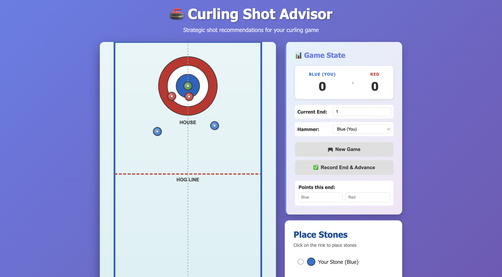
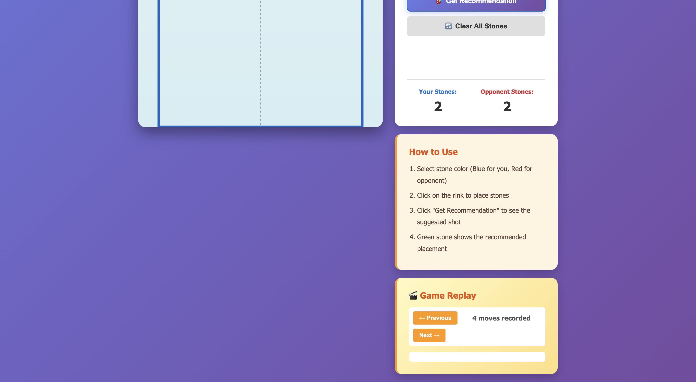

# 🥌 Curling Shot Advisor v3.0

An interactive web application that provides strategic shot recommendations for curling games with full game state tracking and replay functionality.

![Curling Shot Advisor Screenshot]



[View Live Demo](https://rqin0113.github.io/Curling-Shot-Advisor/)

## ✨ New Features (v3.0)

### 🎮 Game State Management
- **Score Tracking**: Track blue and red team scores in real-time
- **End Management**: Keep track of current end (1-10)
- **Hammer Tracking**: Know who has the hammer advantage
- **State Persistence**: Game state automatically synced with backend
- **Quick Game Start**: "New Game" button resets all values

### 🎯 Smarter AI Recommendations
- **Strategy Database Integration**: Uses queries.json for context-aware recommendations
- **Weighted Strategy Matching**: Considers:
  - Current end number
  - Score differential
  - Hammer possession
  - Stone positions
- **Dual-Mode Logic**: Combines strategy database with position analysis
- **Strategy Source Display**: Shows whether recommendation came from database or analysis

### 🎬 Game Replay & History
- **Move History**: Records every recommended shot with:
  - End number
  - Recommended shot type
  - Stone position
  - Team scores at time of recommendation
  - Timestamp
- **Replay Navigation**: Step through game moves:
  - Previous Move button
  - Next Move button
  - Move counter showing progress
- **Move Details Viewer**: See all details of each historical move
- **Clear History**: Start fresh with new game

### 📊 Enhanced Game Display
- **Large Score Display**: Easy-to-read blue vs red scores
- **End/Hammer Indicators**: Know the current game state at a glance
- **Dynamic Updates**: Scores update in real-time

## 🚀 How to Run

### Backend
```bash
python main.py
```
Server starts at: http://127.0.0.1:8000

**API Documentation**: http://127.0.0.1:8000/docs

### Frontend
Simply open `index.html` in your web browser.

## 📋 How to Use

### Starting a Game
1. Click **"New Game"** button
2. Game resets with:
   - Scores: 0-0
   - Current End: 1
   - Hammer: Blue (You)

### Playing a Shot
1. **Select stone color** using radio buttons
2. **Click on the rink** to place stones
3. **Adjust game state** if needed:
   - Change "Current End" if you're analyzing a specific end
   - Toggle "Hammer" to simulate different scenarios
4. **Click "Get Recommendation"** to see suggested shot
5. **Green stone** shows where you should aim

### Completing an End
1. **Enter points** for this end:
   - Blue Points: How many points blue scored
   - Red Points: How many points red scored
2. **Click "Record End & Advance"**
3. Game automatically:
   - Updates total scores
   - Advances to next end
   - Toggles hammer possession
   - Clears the board for next end

### Reviewing Past Moves
1. Look at **Game Replay** section
2. Use **Previous/Next** buttons to navigate moves
3. View all details of each recommendation:
   - Which end it happened in
   - What shot was recommended
   - Board position (x, y)
   - Current scores
   - Exact timestamp

## 🎯 Strategic Recommendations

The advisor recommends shot types based on position AND game state:

### Draw to Button
- Recommended when opponent has no stones in house
- Safest scoring option
- Set up for future ends

### Takeout
- Recommended when opponent has stones but you don't
- Remove their scoring position
- Play aggressively early in the game

### Guard
- Recommended when both teams have stones
- Defensive play to protect your position
- Used when ahead in score or late in the game

### Context-Aware Logic
Recommendations also consider:
- **Early End + No Hammer**: Play aggressive takeouts
- **Late End + Close Game + Hammer**: Play defensive guards
- **Trailing Score**: Take risks with takeouts
- **Leading Score**: Play safe draws and guards

## 🔧 API Endpoints

### Game Management
- `POST /game/new` - Start a new game
- `POST /game/update-state` - Update game state
- `GET /game/current` - Get current game info
- `POST /game/end-end` - Record end result and advance
- `GET /game/history` - Get all moves from current game
- `GET /game/replay/{move_index}` - Get specific move for replay
- `DELETE /game/clear-history` - Clear all history

### Recommendations
- `POST /recommend-shot` - Get shot recommendation with game context
  - Requires: stones array, current_end, blue_score, red_score, has_hammer
  - Returns: recommended_shot, position (x, y), analysis, strategy_source

### System
- `GET /` - Health check with feature list
- `GET /health` - Detailed health status with stats

## 📁 Files

- `index.html` - Main application UI with game state & replay
- `style.css` - Styling for all new game state cards
- `main.py` - FastAPI backend with game tracking & strategy matching
- `queries.json` - Strategy database for context-aware recommendations
- `README.md` - Original documentation
- `README_ENHANCED.md` - This file

## 🔄 Data Flow

```
User Action
    ↓
Frontend Updates Local Game State
    ↓
Send Request to Backend with Game Context
    ↓
Backend Analyzes:
  1. Check queries.json for matching strategy
  2. If no match, analyze board position
  3. Record move in game history
    ↓
Return Recommendation + Analysis
    ↓
Frontend Displays:
  1. Recommended shot
  2. Placement (green stone)
  3. Update move counter
```

## 🧠 Strategy Matching Algorithm

```
For each query in queries.json:
  Score = 0
  
  If query.end == current_end:
    Score += 10  (exact match)
  Elif abs(query.end - current_end) <= 2:
    Score += 5   (nearby end)
  
  If query.score_diff == blue_score - red_score:
    Score += 10  (exact score match)
  Elif abs(query.score_diff - score_diff) <= 1:
    Score += 5   (close score)
  
  If query.hammer == has_hammer:
    Score += 10  (hammer matches)

Return highest scoring query
If no match found, use position-based analysis
```

## 🐛 Bug Fixes (v3.0)

1. Fixed game state not persisting across recommendations
2. Added proper hammer toggling after each end
3. Improved stone overlap detection
4. Fixed replay move counter display
5. Added game state initialization

## 📈 Future Enhancements

- **Difficulty Levels**: Easy (position only), Hard (strategy + position)
- **Shot Power/Curl**: Visualize stone trajectory
- **Multiplayer**: Competitive mode vs. AI
- **Statistics**: Win/loss tracking, shot success rates
- **Save/Load**: Export games to file
- **Advanced Strategies**: Peel, freeze, raise shots
- **Mobile App**: Native iOS/Android versions
- **Coaching Mode**: Explain why a shot is recommended

## 💾 Technical Stack

- **Frontend**: HTML5 Canvas, Vanilla JavaScript
- **Backend**: Python 3.10+, FastAPI, Uvicorn
- **Data**: JSON (strategy database)
- **Architecture**: Client-server with RESTful API

## 🚦 Running the Full Stack

### Terminal 1 - Start Backend
```bash
python main.py
```
Output:
```
🥌 Starting Curling Shot Advisor API...
📍 Server will be available at: http://127.0.0.1:8000
📚 API docs available at: http://127.0.0.1:8000/docs
```

### Terminal 2 - Open Frontend
```bash
# Open in browser
open index.html  # macOS
# or on Linux/Windows, open the file manually
```

### Verify Connection
Check browser console (F12) - should see no CORS errors when you click buttons.

## 📝 Example Game Flow

1. **Click "New Game"** → Scores reset to 0-0, End 1, Blue has hammer
2. **Place stones** → Click blue/red radio, place 4-5 stones each side
3. **Click "Get Recommendation"** → AI recommends "Draw to Button" (green stone appears)
4. **Change End/Scores** if simulating mid-game
5. **Click "Record End"** → 
   - Enter "Blue Points: 2, Red Points: 0"
   - Scores become 2-0
   - End advances to 2
   - Hammer toggles to Red
6. **Review Replay** → Click Next/Prev to see all past shots

## 🎓 Learning Features

Great for:
- **Curling Beginners**: Learn basic strategy (draw, takeout, guard)
- **Skip Training**: Practice decision-making in different scenarios
- **Coach Tools**: Show students why certain shots are recommended
- **Game Analysis**: Review decisions made during actual games

---

**Version 3.0** - Enhanced with game state tracking, smart AI, and replay functionality
**Built with ❤️ for curling enthusiasts**
